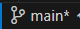
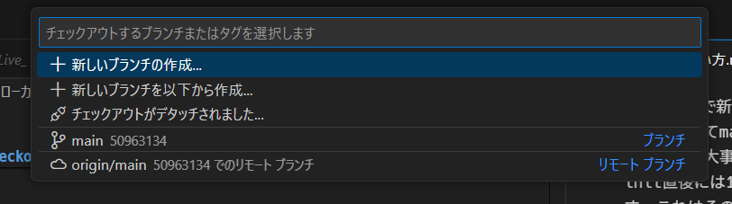

# Gitの使い方

さあ皆さんバージョン管理をしましょう、Gitを使いましょう。

ここからGitを適当に解説します。
巷の解説の大半がGitではなくGitHubかGitLab前提のポンコツ解説なので、
ちゃんと理解したい人には向かない問題を解決するためにこのマークダウンを書いています。
環境構築とか本質じゃないので雑ですし他所に投げることも多いです。

## Gitの考え方

### 概要

ルート分岐ありのバージョン管理をします。以下のようなイメージ。

分岐させることで現時点で動くファイルをいつでも取り出すことができますし、
分離した形で開発を進められます。更に、できたものを統合して更新することも簡単にできます。
無論、だめならなかったことにすることも可能です。
チーム開発をするなら必須です。

### ちょっと用語

バージョン管理している領域全体をリポジトリ、分岐している一つ一つの枝をブランチとよびます。

### リモートとローカルの構造

上でチーム開発をするなら必須と言いました。
それは共有が簡単ということにほかなりません。
これを実現しているのがリモートリポジトリとローカルリポジトリという考え方です。
Gitはローカルだけでも使えますが、リモートと併せて使うのがデファクトスタンダードです。
リモートはローカルとは独立していて、ローカルの変更点をリモートに反映したり、逆にリモートの変更点をローカルに反映したりと、逐次お互いを更新していく形で進みますが、リアルタイムで反映され続けるわけでなく、能動的に更新する動作を必要とします。

## Gitの操作方法

古式ゆかしい使い方ではターミナルにコマンドを打ち込んでやるのですが、カジュアルな使い方ならVSCodeの拡張機能から操作するのが簡単で良いと思います。とりあえずGit Graph, Git History, Git Lensを入れておけば事足るかと。重複する機能もありますが地味に違ううえ、お互い超有名プラグインなので競合を起こす話も聞いたことがないですから、もったいぶらずに入れましょう。（Git GraphとGit Historyはモロに被るプラグインですけど一長一短なので両方。初心者はGit Graphだけでもいい気もしなくもないけど）

以後の操作は一応コマンドも解説しますがメインはGit GraphとVSCodeのGUI操作です。

## 環境構築

全部解説しようかと思ったんですが、面倒だし、先駆者いるし、ってことで丸投げします。

## Git（ローカル）の主な使い方

### 初歩 ~init, add, reset, commit, checkout

gitはあるディレクトリ（Windows風に言えばフォルダ）の中身全てをバージョン管理の対象とします。そしてこのバージョン管理対象のディレクトリをリポジトリと捉えても良いでしょう。
ということでまずはまっさらなディレクトリを作ってください。後々のことを考えてスペースや全角文字を使わず、アルファベットとアンダーバー、ハイフンなどのみで名付けておくと良いでしょう。（ここではexampleとします）
VSCodeのGit

git initで新しいリポジトリを作成し、これと同時にmainブランチが生成されます。ポリコレの波を受ける前はmasterブランチでした。とにかく、main(master)ブランチは最も大事なブランチであり、このブランチを直接編集することは御法度と考えるのが普通です。しかし、init直後には1度だけmasterを直叩きする癖をつけると良いでしょう。それは.gitignoreファイルを作ることです。これはその命名が示す通り、gitの変更履歴に残さないファイルやディレクトリを指定する、拡張子のみのファイルです。キャッシュや中間ファイルなどを指定しておきます。今回は何も指定せずにファイルだけ生成してみましょう。生成したら、これをgitに変更したことを伝えてみましょう。

変更を登録したいファイルをリストアップすることをステージングと言い、ステージされたファイルの変更を登録する動作をコミットと言います。ステージするコマンドはgit addで、コミットするコマンドはgit commitです。コマンドを教えましたが、大丈夫、VSCodeならグラフィカルに出来ます。

サイドバーのソース管理から、「リポジトリを初期化する」を押すと今いるディレクトリ全体（つまり今VSCodeで開かれているフォルダ）をリポジトリとしてgitを初期化します。まずは .gitignore という空ファイルを作ってコミットしてみましょう。何かファイルを編集したり作成、削除したりするとソース管理の変更のプルダウンバーにその変更部分が出てきます。これは最後のコミットからの差分を表しています。今回は.gitignoreの作成なので、.gitignoreの+ボタンを押して変更をステージし、コミットボタンの上の入力枠でコミットメッセージを書き込み、コミットを押します。デフォルトの設定なら、コミットメッセージなしでコミットボタンをおすとコミットメッセージを入力するファイルが開くので、そのファイルを編集してコメントを書いてファイルを閉じて初めてコミットされます。

コミットメッセージは重要です、やったことをを見返したり、他人が追いかけたりするうえでこれ以上なく便利なドキュメントとなります。

### 二歩目 ~branch, checkout, merge, stash, revert

初歩ではGitを使い始める準備を終えました。次にGitを普通に使う方法を学びましょう。
まずはブランチを新しく切ります。mainは完全に動く製品版のようなイメージのブランチなので、次は開発用のブランチが必要ですね。devという名前のブランチを作ってみましょう。ブランチの新設、削除はbranchコマンドで行います、が、例によってVSCodeではグラフィカルに操作可能です。ウィンドウ左下のmainと書いてあるところ

をクリックすると、新しいブランチの作成というメニューが出てきます。

これを選択し、新しいブランチの名前、今回はdevとしてEnterを押して下さい。これで先ほどの左下のmainだったところがdevに変わっていると思います。またmainに戻るときも同じところをクリックして移動先を選べば移動できます。対応するコマンドはcheckoutです。

## memo

- init: ローカルからリポジトリを構築する場合の初手
- clone: リモートリポジトリをそのままローカルに持ってくる。リモートリポジトリが存在する場合、開発開始最初の一手。~~あんまりそれ以外では使わない。~~
- fetch: リモートのブランチを追跡ブランチ(origin)に持ってくる。基本的に実害がほぼ出ないのでガンガン実行しよう。
- merge: 追跡ブランチをローカルの作業ブランチに持ってくる。これは必要なときだけ。
- pull: fetch+merge。微妙にpushと対応してない上に、必要なときしか実行できない都合originが古いままになる原因になるので個人的には非推奨気味。
- checkout: ブランチの新設、移動。
- stash: コミットするまでもない途中経過をおいたり、間違ったブランチで作業した内容を他所に移す時などに使う一時置き。
- cherry-pick: 他所のブランチの一部のコミットだけをつまみ食いするためのコマンド。便利。
- add: コミット予定のファイルをステージングする。
- commit: コミットしてブランチを伸ばす。
- push: ローカルの内容をリモートに送信する。
- reset: いろんな作業をなかったコトにする。コミット、コミット+ステージング、コミット+ステージング+作業内容まで範囲を選べるので消したい範囲でどうぞ。
- revert: 履歴を残してコミットを打ち消す場合はこちら、コミット打ち消しのコミットをします。
- rebase: コミットの履歴を修正します。細かすぎるコミットを結合したり、大きすぎるコミットを分割したりします。ただ、一番良く使うタイミングはmasterの変更を今の作業用ブランチに取り込むタイミングです。なんとなく察しがつくかもしれませんが、破壊的な変更なので、慣れないうちや自信がない場合はそれ用のブランチを切ってやって、だめだったら切り戻すのが良いですね。mergeでやるよりもブランチ図の見栄えがよくなります、覚えたほうが良いコマンド。
- pull request: リモートリポジトリ上ででmergeするためのReviewのリクエスト。こいつが存在するおかげでgitを使うとチーム開発が捗ると言われる。ところでお気づきかと思うが本来はmerge requestとするのが適切であり、この命名は完全に誤り。~~GitHubのアホ。~~
- merge request: リモート状でmergeするためのReviewのリクエスト。こちらはGitLabでの名称でありgitのコマンドと対応している。さすが後発、えらい。

git logなどでターミナルに戻る方法: 半角qです。Ctrl+Cなどではない。

### rebaseとmergeの派閥争い

開発を進めていると、いくつかのタイミングでmasterの変更を開発ブランチに取り込みたいタイミングが出てきます。
このとき、rebaseを使うと見た目が非常に綺麗になるので、人間の理解を助けるように見えます。
実際には一つ問題があり、破壊的な変更かつコミットのハッシュ値を変更するため、実際には全く別のコミットとなります、並行世界みたいな感じとかよく言われる。
これを複数人で使っているブランチに実行したりするとまあとんでもないことになるわけですよ。
割ときちんと論争になっているので調べてもらえばいいと思いますが、私の意見としては適切にrebaseを運用すればいいと思います。
gitの公式にもある通り、手元のコミットをリベースするのはそんなえらいことになるわけではありません。
なぜならそのコミットを知っているのは自分だけであり、rebaseして履歴が書き換わる範囲も自分のコミットだけですから、実行者本人が良ければ問題は起きません。
ただし、一度でも他人の目につくようなリモートリポジトリにアップすれば、それは別の問題です。
歴史改変を目論むテロ組織とタイムパトロールのいたちごっこになります、最早正史は失われ、世界は混沌の渦に飲まれるでしょう。
ちょっと比喩が過ぎましたかね。簡単に言えばrebase前の記憶を持つ人々とrebase後の記憶を持つ人々では話が通じないので、その時点でgitは意味をなさなくなります。
つまり混乱が生じているコミットを全部巻き戻すか、たった一つの正史を定めるかして、規律を取り戻す必要が出てきます。面倒です。
git公式の日本語文を借りれば、
> あぁ、このすばらしいリベース機能。しかし、残念ながら欠点もあります。その欠点はほんの一行でまとめることができます。
>
>**_公開リポジトリにプッシュしたコミットをリベースしてはいけない_**
>
> この指針に従っている限り、すべてはうまく進みます。 もしこれを守らなければ、あなたは嫌われ者となり、友人や家族からも軽蔑されることになるでしょう。

とのことです。公開リポジトリでforce pushを使う必要が出てくるのはそもそも間違いということですね。

多少汚くても他の開発者が関わるところにはrebaseしないことです。rebaseするならこっそりと、完全犯罪をしてくださいまし。もし、どうしても公開リポジトリをrebaseしたくなった時には、関係者全員に了解をとることです。多分難色を示す人が出るけど。

## リモートリポジトリの使い方

さて、ローカルでGitが使えるようになりました。
次に行うのは、そう、リモートリポジトリの扱い。Gi