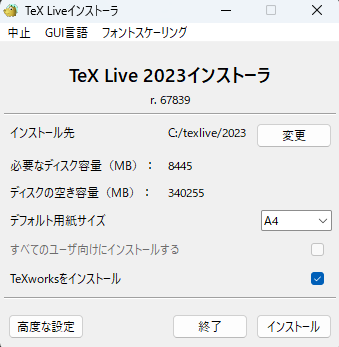
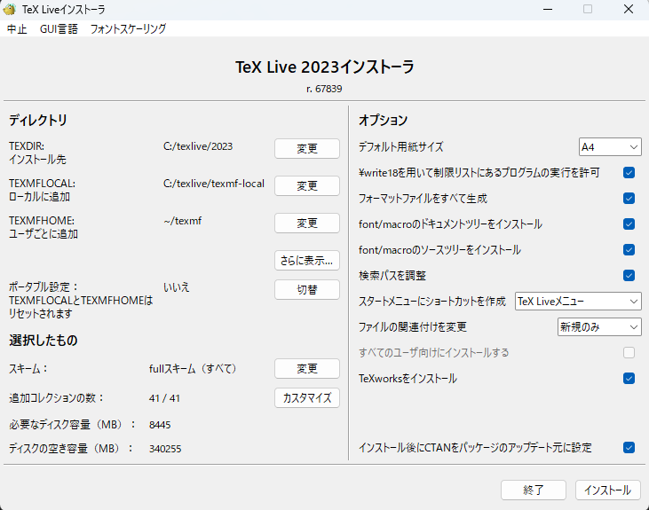

# LaTeXの始め方

みんなも一緒にてふてふしようぜ!！

ということで今回はTeXの始め方を書き残しておきます。

TeXの読み方、テックまたはテフ、というかギリシャ語由来なので発音記号で/x/とかいう訳のわからない発音を本来使うらしいですが、英語話者は/k/発音なのでテックがまだ近い感じ。でもテフのほうがin Japaneseでは通じる。

## TeX/LaTeXとは

数学者Donald.E.Knuth御大が作った組版ソフトがTeXです。組版ソフトというのは出版用の原稿を組むソフトです。TeX言語という独自言語を用いて印刷可能な版を作る、まあ活版印刷のプログラミング版みたいなもんです。専門技能が必要と言っていいでしょう。「数学書つくりたいのに、活版印刷からソフトウェア印刷に変わったから全然思った通りに印刷できへん、せや、活版印刷と同じくらいきれいな印刷が出来るソフトつくったろ、すぐ出来るやろ（すぐ出来ませんでした）」くらいのテンションで作られたらしいですね。バグがめちゃ少ないのでほぼバージョンアップされず、バージョンアップされたら円周率の桁が増えるとかいう一般の開発者が発狂しそうなバージョン管理をしてることでも有名です。

このTeXにあれやこれやマクロを足していって、一般人が辛うじて独学で使えるくらいに落とし込まれたセットがLaTeXです。ゲームが好きなら、TeXがゲームエンジンでLaTeXが実際のソフトウェアと思えばいいでしょう。ま、何でも良し。この文章も後にLaTeXで書き直されるはずです。きっとね。~~面倒くさいのでやらない気もしてきた~~

## 最初にやること

とにかく時間がない場合はWebで便利なOverleafを使いましょう。実験レポート程度ならどうにかなります。

腰を据えて書く場合はコンパイルの制限などの問題で課金でもしない限りは自前のLaTeX環境が必要になります。

迷ったらとりあえずTeX Liveのインストールだけやりましょう。数時間はかかるので迷ってる間に進めてしまうのが良いです。（やり方は後述）

注：適当に気が向いたら更新しますが、最新情報はネットの記事や公式を参考にしてください。（2024年1月4日時点で動く環境です。）

## なんかいっぱいあるよね？

LuaTeXとかXeTeX、pdfTeX, eTeX, pTeX, e-pTex...まあなんかいっぱいありますが
e-pTeX, e-upTeX, XeTeX, LuaTeXくらいでしょう

- **e-pTeX**
Shift-JIS環境の日本語LaTeXいにしえのデファクトスタンダード

- **e-upTeX**
e-pTeXをUnicord対応させた、現在のところのデファクトスタンダード。とはいえLaTeXの近代化改修によるコード書き直しの影響（LaTeX2e→expl3）で、動かない部分が出てきていると言われています。そもそも1Bite文字しか対応してないエンジンに2Bite文字を無理矢理食わせてるような荒技を為ているので、どこかでLuaTeXかXeTeXに移行していく流れになるかと。

- **XeTeX**
LaTeXの理念であるデバイスインディペンデントなんざ知るかということでゴリゴリにデバイス依存になり、その代わりフォント周りなどが簡単になったUnicordネイティブ対応TeX。爆速コンパイルであることも特徴。

- **LuaTeX**
dviという中間ファイルを経由せずにpdfを最初から吐き出すUnicordネイティブ対応TeX。Luaをつかって色々できる様になった、pdfTeXの後継TeX。Luaが使えるのでTikZとの相性が良いらしい。ちょっと重い。

- (pdfTeX)
.dviではなく.pdfを吐いてくれる欧文TEXのデファクトスタンダード

- npTeX
XeTeXにe-upTeXから色々移植して、pTeX系に慣れた人間が使いやすい日本語組版を出来るようにしようとする一派。もしかしたらpTeXと言ったらe-upTeX by npTeX on XeTeXみたいなことになるかも

なお、e-upTeXとe-upLaTeX, LuaTeXとLuaLaTeXというようなものの違いが、TeXがエンジンで、LaTeXがマクロを組み込んだ現実的にエンドユーザーが使用するアプリケーションという認識をしておけば良いです。

次章からは、未だなお和文LaTeXの鉄板とされる、e-upTeXの環境構築を解説します。
正直最初からLuaTeXかXeTeXで始める方が優しい気がしますが、未だにpTeX系でしか使えないテンプレート渡してくる学会もあるらしいのでpTeXから始めます。
LuaTeX,XeTeXはこのマークダウンを読んだ後にLuaTeX/XeTeXの始め方の何方かを読んでください。

## 環境構築

e-upTeXの環境をVS Code上で構築します(Windows)。
といっても多分MacやらLinuxでも最初のインストールが少し違うくらいでVSCodeの設定になればほぼ同じかと思います。
最初に、TeX Liveのインストールを行います。install-tl-windows.exe、もしくはinstall-tl.zipを公式またはミラーサイトからダウンロードし、install-tl-windows.exe、もしくはinstall-tl.zip内のinstall-tl-windows.batを実行してください。
実行してInstallを選択し、暫く経つとこのような画面が表示されます。



高度な設定を選択するとオプションが増えますのでそれを選択してください。


スキームはfullスキーム、追加コレクションの言語欄を

- 日中韓(基本)
- 日本語
- 英語・米語

と、他に各々必要な言語のみがチェックされている状況にします。
さらに、使いませんのでTeXworksをインストールのチェックを外します。

TeX Liveそれ自体がパッケージ管理機能をもつソフトウェアなので、もっと小さいスキームで始めて、足りないものを追加でインストールしたほうが余計なインストールを減らせるそうですが、面倒なのでしません。それがしたい人は各自でどうぞ。
ディレクトリ設定はお好みですが、デフォルトで構わないと思います。

では、インストールボタンをクリックして、インストールが失敗しないように祈りながら数時間から十数時間待つだけです。インストールが終わったら、***必ずパソコンを再起動してください***。あまりにも失敗するようならネットワークインストーラを使わずにISOファイルからインストールする方法に切り替えたほうが良いでしょう。やったことがないので解説は省略。

TeX Liveのインストールは完了しましたね？
では、VS Code上の環境構築に移ります。
まず、James Yuが作者となっているLaTeX Workshopという拡張機能をインストールします。
次に、基本設定>設定から、右上の「設定(JSON)を開く」をクリックしてVS CodeのSettings.jsonを開きます。
（F1キー、もしくはCtrl+Shift+Pでコマンドパレットを開いて「設定」もしくは「setting」で検索して「設定(JSON)を開く Preferences:Open Settings (JSON)」をクリックしても開けます。）

ここからはJSONの中身の編集です。
以下のコードをJSONの中に転記してください

```json
    // LaTeX 
     "latex-workshop.intellisense.package.enabled": true,
     //ビルド失敗時に補助ファイル削除
     "latex-workshop.latex.autoClean.run": "onFailed",
     //削除する補助ファイルを追加
     "latex-workshop.latex.clean.fileTypes": [
         "*.aux",
         "*.blg",
         "*.idx",
         "*.ind",
         "*.lof",
         "*.lot",
         "*.out",
         "*.toc",
         "*.acn",
         "*.acr",
         "*.alg",
         "*.glg",
         "*.glo",
         "*.gls",
         "*.ist",
         "*.fls",
         "*.log",
         "*.fdb_latexmk",
         "*.snm",
         "*.nav",
         "*.dvi",
         "*.synctex.gz"
     ],
     
     //latexmkのビルドレシピ
     "latex-workshop.latex.recipes": [
         //bibTexを使用しない場合のレシピ
         {
            "name": "ptex2pdf (uplatex)*1",
            "tools": [
                "ptex2pdf (uplatex)",
                "ptex2pdf (uplatex)"
            ]
        },
         {
             "name": "ptex2pdf (uplatex)*2",
             "tools": [
                 "ptex2pdf (uplatex)",
                 "ptex2pdf (uplatex)"
             ]
         },
         //bibTexを使用する場合のレシピ
         {
             "name": "ptex2pdf (uplatex) -> bibtex -> ptex2pdf (uplatex) *2",
             "tools": [
                 "ptex2pdf (uplatex)",
                 "upbibtex",
                 "ptex2pdf (uplatex)",
                 "ptex2pdf (uplatex)"
             ]
         },
     ],
     
     //latexmkのビルドツール
     "latex-workshop.latex.tools": [
         {
             "name": "ptex2pdf (uplatex)",
             "command": "ptex2pdf",
             "args": [
                 "-interaction=nonstopmode",
                 "-l",
                 "-u",
                 "-ot",
                 "-kanji=utf8 -synctex=1",
                 "-file-line-error",
                 "%DOC%"
             ]
         },
         {
             "name": "upbibtex",
             "command": "upbibtex",
             "args": [
                 "-kanji=utf8",
                 "%DOCFILE%"
             ]
         },
         {
             "name": "biber",
             "command": "biber",
             "args": [
                 "%DOCFILE%"
             ]
         },
     ],
     
     //これより下の設定は人それぞれかも
     "latex-workshop.view.pdf.viewer": "tab",
     //chkTeXは構文チェッカー
     "latex-workshop.chktex.enabled": false,
     "latex-workshop.latex.autoBuild.run": "never",
     "editor.minimap.enabled": false,
     "grammarly.files.include": [
         "**/readme.md",
         "**/README.md",
         "**/*.txt",
         "**/*.tex"
     ],
```

一番外側の波括弧の中においてください。位置は上でも下でも構いません。LaTeX Workshopをインストールしたときに、ほぼ似たようなオプションが生成されている場合は容赦なく消し飛ばして置換してください。
少しだけ説明しますが、ビルド時に実行するツールやそのオプションを定義しているのが "latex-workshop.latex.tools" で、それをどの順序で呼び出すかを決めているのが "latex-workshop.latex.recipes" です。LaTeXは参照関係の都合などで複数回ビルドして初めてまともな文書を出力します。この面倒な複数回ビルドのマクロを定義しているのがレシピです。

編集が終わったらCtrl+Sでセーブを忘れずに。

セーブされたらあと一息です。最後にビルドレシピを呼び出すためのショートカットキーを登録します。
 Ctrl+K → Ctrl+S と操作し、検索窓に build with recipe を入力し、出てきた LaTeX Workshop: Build with recipe に Ctrl+Alt+B を割り当てます。（重複したり気に入らない場合はお好きに。）

お疲れ様です。これで基本の環境構築は終了です。

簡単なTeXファイルをビルドしてみましょう。

ディレクトリが汚れがちなので新しいフォルダを用意して (任意の名前).tex を用意してください。アイコンがTeXになっていれば拡張機能がきちんと仕事をしています。
TeXファイルを以下のように編集します。

```latex
\documentclass[a4j,12pt]{ujreport}
\title{ {\LaTeX} 動作確認テスト}
\author{瀧本英智}
\date{\today}
\begin{document}
\maketitle

\chapter{\LaTeX の世界にようこそ！}

\section{インストール成功！}
\LaTeX の世界にようこそ！この文章がpdf形式できちんと読み込めていれば、
インストールに成功しています。

\LaTeX （ラテック、ラテフ）もしくは\TeX （テック、テフ）は、
組版処理を行うソフトウェアです。
数学者・コンピュータ科学者のドナルド・クヌース氏によって作られました。
本来は\LaTeX 、\TeX と表記するのが正しいですが、この用に表記できない場合はLaTeX、TeXというふうに字が下がっている部分を小文字で表記します。

数式出力を見てみましょう。
\begin{eqnarray}
& \displaystyle \lim _{x \rightarrow 1} \left( \frac{2}{x-1} - \frac{x+5}{x^3 -1} \right)\; ,\; \label{hoge} 
& \displaystyle \int ^\pi _0 \cos ^2 (x)dx \nonumber \label{fuga}
\end{eqnarray}
2つの数式\ref{hoge} ,\ref{fuga} が、きちんと表示されていますか？
複雑な数式が入った文章であっても、綺麗に表示させられますし、
なにより、Wordのように、文字数が増えてきたり画像が増えてきた時に
表示がおかしくなったり設定が適用されなくなったりすることがありません。
もちろん、ファイルが大きくなればビルドに時間がかかるようにはなりますが、
\TeX はあまり気まぐれを起こしません、偶には多少起こしますけど、
あまり致命的ではないですし、再現性があることがほとんどです。
つまり大概はあなたの打ち込んだコードが間違えています。
心配せずともエラー表示も出してくれます。優しい。
\\
あ、そうそう。この参照番号も、IDで紐づけしておけば自動で振ってくれます。これで図や数式の追加や削除をしても余計な作業が増えません。
ね、素敵でしょ？

\end{document}
```

編集し終わったら先程登録したショートカットキー Ctrl+Alt+B を実行して、ビルドレシピを選択しましょう。ptex2pdf(uplatex)*2で結構です。一回目のビルドが終わった段階ではちょっとしたWarningが4つほど出るかと思いますが、それは参照の問題です。続く二回目のビルドが終われば綺麗サッパリ消え去って、あとには (任意の名前).pdfが生成されているはずです。

うまく行かない場合は1行目の
`\documentclass[a4j,12pt]{ujreport}`
を
`\documentclass[a4j,12pt,uplatex]{jsreport}`
にするのも試してみてください（本来どっちでも似たような文章ができるはずですが）。

そもそもビルドが開始されない場合はちょっとディレクトリ構成が壊れている可能性があります。
PATHを通して下さい。システム設定をいじっても良いですし、LaTeX Workshop内で完結させるのならば、
ビルドツールの"args"の下に以下を追記すれば良いです（Pathは参考までに、Mac環境の場合のデフォルト値です）。
"args"の終わりに,を入れるのを忘れずに。

```json
        {
             "name": "ptex2pdf (uplatex)",
             "command": "ptex2pdf",
             "args": [
                 "-interaction=nonstopmode",
                 "-l",
                 "-u",
                 "-ot",
                 "-kanji=utf8 -synctex=1",
                 "-file-line-error",
                 "%DOC%"
             ],
             "env":{
                "Path": "${env:Path}]:/Library/TeX/texbin"
             }
        }
```

うまく行った場合はおめでとうございます。これで環境構築は一段落…です。

### レシピとは？

LaTeX Workshop特有のあれですが、なんせTeXは複数回ビルドしないと式番号の参照なんかがぐちゃぐちゃ、参考文献とか入り出したらもっとぐちゃぐちゃなので、いろいろ出来るようにしてます。ただし、ビルド回数が増えるほど時間が掛かるので、基本は1回か2回だけビルドして、ちゃんと全体を見るときだけ時間をかけてビルドします。参考文献あり（bibtex）を挟んで3回くらいがベーシック。

<details><summary>ちょっと細かい話</summary>

ちょっと細かい話をすると、latex-workshop.latex.toolsで一回あたりのビルドの設定をしてます。nameはただの名前なので判別生さえ確保すれば好きにつけて良いです。commandはビルドに使うツールです。今回はptex2pdfというptex系でpdfを吐くためのツールを指定しましたが、latexmkあたりの定番ツールやcluttexあたりを使うことも出来ます。argsでオプションを渡します、基本的にはコマンドライン実行するときと同様にオプションを書いていけば良さそうです。同じコマンドのオプション違いも名前さえ変えれば用意出来ます。

latex-workshop.latex.recipeでは、この指定したtoolのどれをどの順番で実行するかを指定します。このときtoolsで指定したnameを書いて指定します。latexmkなどの自動化ツールで何回実行するなどを指定していない場合（ptex2pdfを使用する場合はこれ）は、実行する回数分だけ記述すれば良いです。latexmkを使う場合などはどの設定のlatexmkを使うかだけ指定すれば良いでしょう。recipeのnameはビルドするたびに見て選択することになるので、パッと識別できる名前をつけておくと良いでしょう。
</details>

### エラーを叩き潰したい貴女に

<details><summary>なんか便利ツール使ってない？</summary>

cluttexとかllmkとか使っててなんかエラー周りがちゃんと動かないなあってなってるんだったら、latex workshopの問題のことが多いです。latex workshopは、latexmkを使っているときだけは巧く動くように専用の動作を入れてやってるらしいですけど、他の自動ビルドツール（cluttexとかllmkとか）を使うと設計の悪さが露呈します。今のところ対処法はなく、対症療法としてコマンドラインの実行結果をのぞきに行くしかないです。VSCodeのエラー欄がうまく使えないのはなんというかちょっと嫌ですが、そうするしかない。
よっぽど何かを信仰していない限り、自分でptex2pdfとかを何回か実行するレシピを設定する方が幸せかも、それかlatexmkを使うか。~~でも私はClutTeXを信仰したい~~
</details>

<details><summary>パッケージが動かん</summary>

公式とか作者のサイト見に行って、オプションの書き方とか調べた方が良いかも。
たまに前提となるパッケージが存在したりするので。
それと、シンプルでないパッケージほどよく調べましょう。
あとはエラー文そのままコピペして検索とか。
</details>

<details><summary>数式が崩れたり現れへんかったりすんねんけど</summary>

すまん、がんばって・・・。だいたい一文字間違えてるとか、括弧が足りてないとか。根気が必要。
</details>

### 簡易確認ビルドに時間が掛かりすぎ

<details><summary>一回だけのビルドで試して、ダメならファイル分割パッケージを使おう</summary>

上で触れたレシピで、一回だけビルドするものを試して見てください。それでダメなら、TeXファイルが大きすぎるので分割しましょう。

\inputという命令で、TeXファイルの中で他のTeXファイルを割り込ませることが出来ます。が、このままだと割り込ませるTeX単体ではビルド出来ません。
\docmuteを使いましょう。プリアンプルという上の方の設定を割り込ませる時に無視してくれるパッケージです。これを使うと、分割した先のTeXファイルで適宜プレビューしながら、最後の出力だけ全部まとめて、と言うことがやりやすくなります。

全体で使っているパッケージを統一するために、プリアンブルだけをまとめたTeXファイルを\inputして使うと便利です。

\subfilesを使うことも出来ます。ま、このあたりは宗派でしょ。
</details>

### フォント変えたい

XeTeXかLuaTeX使いましょう。これは別のマークダウンで解説してます。
pTeX系でフォントを変えるのは面倒らしくてやったことないので触れません。自分で調べてください。

### もうちょっと細かいコマンドの解説

<details><summary>ビルドツールで使ってるコマンドの意味について。</summary>

ビルドツールのargsはコマンドラインで実行する際のオプションを指定している。カンマがスペースに相当すると考えれば良い。

`-interaction=nonstopmode`はエラーが出ても中断しないオプション。VSCodeとの都合、これがないと詰むので必須。
`-file-line-error`というコマンドもLaTeX Workshop的に必須で、LaTeX Workshopでエラー箇所にジャンプする機能を使うためにはこれが要る。
`-halt-on-error`は最初のエラー箇所で終了するオプション。`-interaction=nonstopmode`とは併用不可、`-interaction=nonstopmode`が優先
`-kanji=utf8`はUnicord対応のおまじない
`-synctex=1`はSyncTeXファイルの生成オプション。SyncTeX対応のビューワならPDFとTeXの対応がとれるよ。（編集したい箇所に飛ぶのに便利）
`%DOC%`や`%DOCFILE%`はマクロで、VSCodeでコンパイルを実行したときのファイル名に置換されるもの。
他のコマンドは[ptex2pdf作者様のサイト](https://www.preining.info/blog/software-projects/ptex2pdf/)を参考にして下さい。
</details>

<details><summary>LaTeX Workshopの設定</summary>

`latex-workshop.latex.autoClean.run`を`onFailed`から書き換えると補助ファイル群の挙動が変わります。
`never`にすると補助ファイルは消えず、`onBuilt`にするとビルド成功かどうかに関わらず毎回消えます。
消さない方がビルドがちょっと早いとか、一回しかビルドしなくても前回の残り物があるからある程度図表番号が出るとか、そういうのはある。けど消しても良い。ここは流派。

で、こんなところまで開いて読むような、そう、そこのあなたみたいな人間なら、削除する補助ファイルから.logを抜いておくと良いかも。たまにはエラー解消に役立つこともあるので。
</details>

### BibTeXとBibLaTeX

<details><summary>BibTeXとBibLaTeX、何が違うんじゃい！</summary>

となったのでまとめる。
そもそもこの二つは参考文献を管理するためのものです。
BibTeXの後継がBibLaTeX。
で、どちらも.bibファイルを読み込める。ここは互換性がある。
んですが、ちょっとややこしい話。
BibTeXはTeXなので単体で実行可能なのに対して、BibLaTeXはLaTeXなのであくまでマクロセット。なので実行するバックエンドが必要で、そのバックエンドとして用いるのがbiber。実用上ほぼセットで使うのでBibLaTeXと言えばbiberをセットと思うし、biberとだけ書いてBibLaTeXをさすこともある。
で、マクロセット化したことにより自由度が上がったのがBibLaTeXと思えば良い、らしい。
頭空っぽにしてBibLaTeX使えばえーんちゃう…？（なげやり）と思うがそもそもTeXなんかレガシーの塊みたいなもんなんで残ってるのも致し方ないのかもしれない。

で、なんで上ではBibTeXを使ったかと言うと、そっちの方がレガシーだから。
そもそもe-upLaTeXなんざレガシーなので、ぽんと渡された参考ファイルがBibTeXのことの方が多そう、というやつ。~~知識と環境をアップデートしてほしい~~
</details>

## latexmkを使う(ここは参考にしないで)

古から続く自動化ツールです。

latexmkは.latexmkrcという設定ファイル（perlで記述）を読み込んで諸々自動でビルドするツールですが、なにせ設定が難解かつ統一的な日本語リファレンスが存在しないのが問題。
かき集めた情報をここに残す。

基本的にはルートディレクトリないしそれに近い階層に.latexmkrcをおき、必要な場合カレントディレクトリに.latexmkrcを別に作って、ルートのそれによる設定を上書きして用いる。

なにはともあれ瀧本の推奨する.latexmkrcファイルが以下

```perl
#!/usr/bin/env perl

# Optionなしでlatexmkを実行したときのデフォ
$latex            = 'uplatex %O -synctex=1 -halt-on-error -interaction=nonstopmode  %S';
# -lualatexをつけたとき
$lualatex         = 'lualatex %O -synctex=1 -halt-on-error -interaction=nonstopmode %S';
# -xelatexをつけたとき
$xelatex          = 'xelatex %O -no-pdf -synctex=1 -halt-on-error -interaction=nonstopmode %S';

# Biber, BibTeX
$bibtex           = 'upbibtex';
$biber            = 'biber --bblencoding=utf8 -u -U --output_safechars';

# dvipdf
$dvipdf           = 'dvipdfmx %O -o %D %S';
# dvips,ps2pdf これは省略

# 索引作成ソフト
$makeindex        = 'upmendex %O -o %D %S';

# 繰り返し回数制限
$max_repeat       = 5;

# PDF吐き出し方法
# 0: pdf生成しない
# 1: pdfLaTeXで生成
# 2: .psを経由してpdf生成
# 3: .dviを経由してpdf生成
# 4: luaLaTeXで生成
# 5: XeLaTeXで生成
$pdf_mode         = 3;
# pdfのビューワーの実行ファイルを指定する。WinではSynctexに対応するSumatraが推奨
# $pdf_previewer = '"C:/Program Files/SumatraPDF/SumatraPDF.exe" -reuse-instance';

$pvc_view_file_via_temporary = 0;

```

主な変数
%O：実行時オプション
%S：ソースファイル名
%D：出力ファイル名
%B：拡張子なしソースファイル名

変数はある程度適当なものをlatexmkの方で補完してくれるが、dvipdfmxについては補完が聞かないので確実に書くこと。
